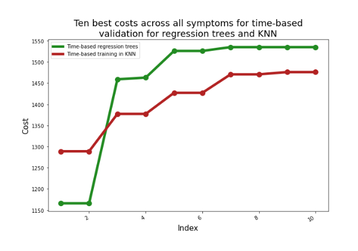
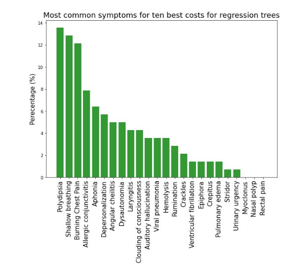

# Analyzing COVID-19 Search Trends and Hospitalization

We implemented supervised learning, via both k-nearest neighbors and regression tree models, to examine whether Google search trends for various medical symptoms are related to COVID-19 hospitalizations. If so, public health experts could use search trends to better detect COVID-19 outbreaks earlier in communities. Two datasets compiled by Google were used - one that included weekly data reflecting the volume of Google searches for health symptoms across multiple US states, and the other that included data for daily and cumulative COVID-19 hospitalizations for each US state. Prior to implementing these models, k-means clustering and PCA reduction were used to help us understand the provided data.

We concluded that supervised learning can be used to predict COVID-19 hospitalizations as we observed that many of the medical symptoms that one expects to be correlated to COVID-19 were those that produced some of the best validation results.

